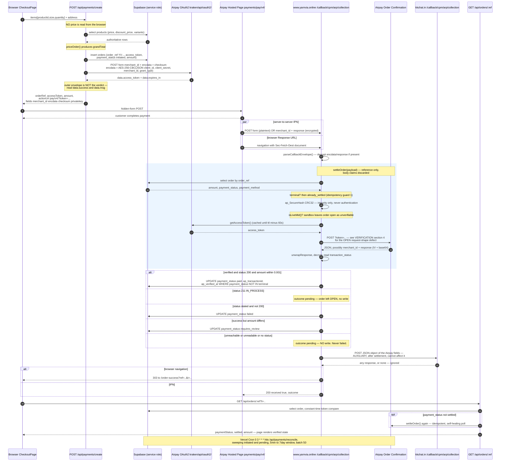

# Airpay Integration Architecture — Yarnvia

**Status:** design specification. Written from (a) the proven Frontiva
implementation and its three analysis documents, and (b) a full read of the
current Yarnvia codebase on branch `main` at commit `313047a`.

**Scope note — read this first.** The brief that commissioned this document
assumed Yarnvia had no Airpay integration. **That is no longer true.** Yarnvia
already ships a working payment tier under `api/`, including the public callback
route at `api/callback/cpm/arp/collection.ts`, the KKChat relay, reconciliation
cron and settlement. This document therefore describes the *intended* flow and
marks, at each step, whether Yarnvia already implements it. Nothing here has
been implemented or modified by this task.

Evidence for every claim is tagged:

| Tag | Meaning |
| --- | --- |
| **PROVEN** | Read directly from Yarnvia or Frontiva source, or pinned by a test |
| **OBSERVED** | Recorded in-repo as behaviour seen from live Airpay in production |
| **INFERRED** | A reasoned conclusion that no source or capture confirms |
| **UNKNOWN** | Must not be guessed — see the Known Unknowns section of the plan |

Companion documents:

- [AIRPAY_YARNVIA_VERIFICATION.md](AIRPAY_YARNVIA_VERIFICATION.md) — crypto, OAuth, Order Confirmation, settlement rules
- [AIRPAY_YARNVIA_CONFIGURATION.md](AIRPAY_YARNVIA_CONFIGURATION.md) — environment, dashboard, routing
- [AIRPAY_YARNVIA_IMPLEMENTATION_PLAN.md](AIRPAY_YARNVIA_IMPLEMENTATION_PLAN.md) — phased plan, testing matrix, known unknowns
- [AIRPAY_YARNIVA_DEPLOYMENT.md](AIRPAY_YARNIVA_DEPLOYMENT.md) — pre-existing deployment guide (not written by this task)

Reference implementation (read-only, another repository):
`../../clone/store/` and its `docs/AIRPAY_FIRVANA_*.md`.

---

## 1. The public URLs

These are the exact values supplied by the team for MID **366950**. No other
public URL is part of this integration, and none may be invented.

| Role | URL | Who calls it |
| --- | --- | --- |
| Merchant domain | `https://www.yarnvia.online` | — |
| **Response URL** (Success/Failed) | `https://www.yarnvia.online/callback/cpm/arp/collection` | Airpay redirects the **customer's browser** here |
| **IPN / Webhook URL** | `https://www.yarnvia.online/callback/cpm/arp/collection` | Airpay's **server** POSTs here |
| KKChat relay destination | `https://kkchat.in/callback/cpm/arp/collection` | **Yarnvia** POSTs here, outbound only |

### 1.1 How these three relate

**The Response URL and the IPN URL are the same string.** That is deliberate and
matches the Frontiva integration, where the identical path served both
(`CALLBACK_PATH` in Frontiva's `api/_lib/config.js`). **PROVEN.**

One path, two kinds of caller:

```
                        MID 366950 dashboard
                                |
        +-----------------------+-----------------------+
        |                                               |
  Response URL                                     IPN URL
  (browser navigation)                        (server-to-server)
        |                                               |
        +-------------> https://www.yarnvia.online <----+
                        /callback/cpm/arp/collection
                                |
                    one serverless function
                                |
              +-----------------+-----------------+
              |                                   |
      Sec-Fetch-Dest: document              no such header
              |                                   |
     303 -> /order-success?ref=..&t=..    200 {"received":true,..}
```

Both legs run **the same settlement** before the reply shape is chosen. The
browser leg cannot bypass server-side verification — spoofing `Sec-Fetch-Dest`
changes which response you get and nothing about whether an order is paid.
**PROVEN** — `api/callback/cpm/arp/collection.ts`, `api/_lib/callbackFlow.ts`.

**KKChat is downstream of Yarnvia, never upstream.** Airpay does not call
kkchat.in in this architecture, and Yarnvia never reads anything KKChat returns.
The relay exists so the merchant's pre-existing reconciliation keeps seeing the
events it always saw. It is auxiliary by construction: it runs *after*
settlement, cannot throw, never retries, and is bounded by a 5 s timeout.
**PROVEN** — `api/_lib/relay.ts`.

**Neither URL is settable per transaction.** Both are MID-level dashboard
settings; the Simple Transaction request carries no URL parameter. Frontiva
sends `successUrl`/`failureUrl` anyway "for completeness only" and its source
states they "do not substitute for" the dashboard settings. Yarnvia's
`api/payments/create.ts` does not send them at all. **PROVEN** (both sources).

### 1.2 Internal API routes — separate from the public callback URL

These are Yarnvia's own endpoints. **Airpay is not configured to call any of
them** and they must never be registered in the Airpay dashboard.

| Internal route | Method | Purpose | Exists today? |
| --- | --- | --- | --- |
| `/api/payments/create` | POST | Re-price basket, insert order, mint token, return signed form fields | **Yes** |
| `/api/payments/callback` | POST, GET | Legacy IPN endpoint; same pipeline, kept working if the MID is ever repointed | **Yes** |
| `/api/payments/return` | GET, POST | Legacy browser-return endpoint; settles, then redirects. Does **not** relay | **Yes** |
| `/api/orders/:ref?t=<token>` | GET | Authoritative payment status for the success page; self-healing poll | **Yes** |
| `/api/payments/reconcile` | GET, POST | Cron sweep, `Authorization: Bearer $CRON_SECRET` | **Yes** |
| `/api/health` | GET | Deployment commit, config presence booleans | **Yes** |

The physical file backing the public callback path is
`api/callback/cpm/arp/collection.ts`. Vercel's filesystem router requires the
`/api` prefix; `vercel.json` rewrites the public path onto it **in place**, so
one Airpay delivery is one function invocation. Yarnvia makes no HTTP request to
itself. **PROVEN** — `vercel.json`.

---

## 2. End-to-end flow

### 2.1 Narrative

1. **Checkout.** The shopper fills the address form and selects *Pay Online*.
   `src/pages/Checkout/CheckoutPage.tsx` calls `createPayment()` in
   `src/services/payment.ts`. The request carries **product id, size and
   quantity only** — no price, no subtotal, no total. **PROVEN.**

2. **Payment creation.** `POST /api/payments/create` re-prices the basket from
   the `products` table (`api/_lib/pricing.ts`, `priceOrder`), applies the
   shipping rule, and derives `grandTotal`. Nothing the client sent about money
   is read. **PROVEN.**

3. **Order creation.** A row is inserted into `public.orders` with
   `order_ref` (`YV-...`), a random `access_token`, `payment_method='airpay'`,
   `payment_status='initiated'` and the authoritative `amount`. **PROVEN.**

   > **Divergence from Frontiva.** Frontiva authenticates with Airpay *before*
   > inserting the order, so a credential failure leaves no orphan row. Yarnvia
   > inserts *first*, deliberately, so a gateway outage leaves a recorded
   > `initiated` order rather than a silent nothing. Both are defensible; the
   > Yarnvia choice depends on reconciliation being able to close the orphan.
   > **PROVEN** (both, from source comments).

4. **Airpay OAuth.** `getAccessToken()` posts `{merchant_id, encdata, checksum}`
   form-encoded to `https://kraken.airpay.co.in/airpay/pay/v4/api/oauth2/`. The
   credentials travel **inside** `encdata`, never as plain fields. Yarnvia
   caches the token in module scope with a 60 s safety margin; Frontiva does not
   cache. **PROVEN.**

5. **Airpay payment URL.** The action becomes
   `https://payments.airpay.co.in/pay/v4/?token=<access_token>`. The token goes
   in the **query string**, never in an `Authorization` header. **PROVEN.**

6. **Hidden form POST.** `redirectToAirpay()` builds a hidden
   `<form method="POST">` in the DOM and submits it with four fields:
   `merchant_id`, `encdata`, `checksum`, `privatekey`. A redirect will not do —
   the hosted page expects a form body. **PROVEN.**

7. **Customer pays** on Airpay's hosted page.

8. **Response URL + IPN.** Airpay delivers to
   `https://www.yarnvia.online/callback/cpm/arp/collection` twice: once as a
   browser navigation, once server-to-server. Ordering between the two is not
   guaranteed and either may arrive first. **PROVEN** (Frontiva source states
   the race; Yarnvia's code is written for it).

9. **Callback processing.** `processAirpayCallback()` runs
   parse → settle → relay, in that order. Parsing accepts a plaintext form POST,
   a JSON body, a query string, or an encrypted `{merchant_id, response}`
   envelope. **PROVEN.**

10. **Order verification.** `settleOrder()` discards everything in the callback
    body except the order reference and asks Airpay's Order Confirmation API
    what actually happened. **The callback is a prompt to go and check, never
    proof of payment.** **PROVEN.**

11. **Settlement.** A conditional `UPDATE ... WHERE payment_status NOT IN
    (terminal)` applies the decision. Two concurrent callbacks cannot both win.
    **PROVEN.**

12. **Success / failure.** The browser is 303-redirected to
    `/order-success?ref=<order_ref>&t=<access_token>`. The redirect asserts
    **nothing** about the outcome; the page polls `/api/orders/:ref` and renders
    only what the server verified. **PROVEN.**

13. **Reconciliation.** A Vercel Cron entry sweeps orders still `initiated` or
    `pending`, older than 5 minutes and younger than 7 days, in batches of 50,
    and runs the same `settleOrder`. **PROVEN.**

### 2.2 Sequence diagram



---

## 3. Order state machine

Yarnvia's `payment_status` values, from the CHECK constraint in
`supabase/migrations/0003_orders.sql`. **PROVEN.**

```
                         insert (create.ts)
                                |
                                v
                          +-----------+
       +------------------| initiated |<-------------+
       |                  +-----+-----+              |
       |                        | settleOrder()      | retry from any open
       |                        v                    | state: IPN, browser
       |            +-----------------------+        | return, status poll,
       |            | Order Confirmation    |        | reconcile cron
       |            +---+----+----+-----+---+        |
       |                |    |    |     |            |
       |   no answer /  |    |211 |!=200| 200 but    |
       |   no status /  |    |    |     | amount !=  |
       |   unreachable  |    |    |     |            |
       |                v    v    v     v            |
       |          (no write) |  +------+  +----------------+
       +----------------+----+  |failed|  |requires_review |
                                +------+  +----------------+
                                TERMINAL      TERMINAL
                                |
                  200 and amount matches
                                v
                           +--------+
                           |  paid  |  TERMINAL
                           +--------+
                 + ap_transactionid, ap_verified_at
```

| State | Meaning | Terminal? |
| --- | --- | --- |
| `pending` | Table default; not used by the Airpay path | No |
| `initiated` | Order written, customer sent to Airpay | No |
| `paid` | Order Confirmation said success **and** the amount matched | **Yes** |
| `failed` | Order Confirmation stated a status that was not success | **Yes** |
| `cancelled` | Shopper abandoned the gateway (`cancelOrder`) | **Yes** |
| `requires_review` | Airpay confirmed success for a *different* amount — money may have moved | **Yes** |

`TERMINAL = {paid, failed, cancelled, requires_review}` in `api/_lib/settle.ts`,
and the same list is the `not.in` filter on every conditional update. Including
`requires_review` in the terminal set means a later callback cannot quietly
overwrite a human-investigation flag. **PROVEN.**

> **Divergence from Frontiva.** Frontiva treats `requires_review` as *open* and
> re-checks it in reconciliation; Yarnvia treats it as terminal. Frontiva also
> has an explicit `processing` state for `INPROCESS`; Yarnvia writes **no row
> change at all** for `211` and simply leaves the order `initiated`. The Yarnvia
> approach keeps the sweep picking it up (the sweep filters on
> `initiated`/`pending`) but loses the ability to tell "in process at the bank"
> apart from "never left checkout" by reading the row alone. **PROVEN.**

---

## 4. Database

Single table, `public.orders` — `supabase/migrations/0003_orders.sql`. **PROVEN.**

| Column | Type | Role |
| --- | --- | --- |
| `id` | uuid PK | — |
| `order_ref` | text **unique** | The `orderid` sent to Airpay. Format `YV-<5 chars>-<8 hex>` |
| `access_token` | uuid | Opaque per-order read key for the success page |
| `status` | text | Fulfilment lifecycle, default `pending` |
| `payment_method` | text CHECK in (`cod`,`airpay`) | Structurally separates COD from online |
| `payment_status` | text CHECK (6 values) | **Authoritative** online payment state |
| `amount` | numeric(10,2) | **THE authority.** Server-derived, never client-supplied |
| `currency` | text | `INR` |
| `address`, `items` | jsonb | Snapshot at order time |
| `ap_transactionid` | text | Airpay's own transaction id, written at verification |
| `ap_verified_at` | timestamptz | When Order Confirmation was consulted |
| `inventory_applied` | boolean | Idempotency guard for a future stock decrement (unused) |

**RLS is enabled with deliberately no policies.** Under Postgres RLS a table with
no matching policy denies everything, so the anon key in the browser bundle can
neither read nor write an order. Only `SUPABASE_SERVICE_ROLE`, held exclusively
by the functions in `api/`, reaches it. **PROVEN.**

### 4.1 Gap against Frontiva: no callback audit table

Frontiva has `public.payment_events` with a **unique `dedupe_key`**, which makes
an IPN redelivery a no-op insert and gives an audit trail of every delivery.
**Yarnvia has no equivalent table.** Its duplicate protection is the terminal-state
guard plus the conditional UPDATE, which is sufficient to prevent double
settlement but provides:

- no record that a callback was ever received for an order that is still open;
- no way to distinguish "Airpay never called" from "Airpay called and we could
  not parse it";
- no forensic payload for a disputed transaction.

This is a real gap and is Phase 1 of the implementation plan. **PROVEN**
(absence verified across `supabase/migrations/`).

---

## 5. Routing — the mistake that must not be repeated

The previous Yarnvia investigation found that `/callback/cpm/arp/collection` did
not resolve to a serverless function: it fell through the SPA catch-all rewrite
and was served by the static file server. A GET returned `index.html`; Airpay's
POST was answered `405 Method Not Allowed` with an empty body. Order
`YV-3200A-2AB47227` — a real, successful ₹81 UPI payment, Airpay transaction
`2051234202` — sat at `payment_status = initiated` because of exactly that.
**OBSERVED**, recorded in `api/callback/cpm/arp/collection.ts` and
`docs/AIRPAY_YARNIVA_DEPLOYMENT.md` section 18.

### 5.1 The requirement

> **Airpay's public callback URL must resolve to a real backend / serverless
> function BEFORE the SPA catch-all rewrite.**
>
> ```
> POST /callback/cpm/arp/collection  ->  backend callback handler
> GET  /callback/cpm/arp/collection  ->  browser return handler
> ```
>
> It must **not** become `index.html`, and it must **not** answer 405.

### 5.2 Current state — already satisfied

`vercel.json` today contains, in order:

```json
"rewrites": [
  { "source": "/callback/cpm/arp/collection",  "destination": "/api/callback/cpm/arp/collection" },
  { "source": "/callback/cpm/arp/collection/", "destination": "/api/callback/cpm/arp/collection" },
  { "source": "/((?!api/).*)",                 "destination": "/index.html" }
]
```

Three properties make this correct, and all three are load-bearing:

1. **The callback rewrite precedes the catch-all.** Vercel evaluates `rewrites`
   top-down and takes the first match. Reorder these and the callback breaks.
2. **The trailing-slash variant is listed separately.** Airpay's dashboard value
   is stored without one, but a redirect or a proxy can add it; without this line
   `/callback/cpm/arp/collection/` would hit the SPA. **INFERRED** that Airpay
   may send it — the second rule is cheap insurance either way.
3. **The catch-all uses a negative lookahead `(?!api/)`**, so `/api/*` can never
   be swallowed. Frontiva achieves the same with an explicit `/api/(.*)`
   passthrough rule ahead of the catch-all; both work.

`vercel.json` is **not modified by this task** and needs no change. The
implementation plan's Phase 6 is therefore a *verification* phase, not a
construction phase.

### 5.3 How to prove it in production

```bash
# Must be JSON from a function, never HTML.
curl -s -X POST https://www.yarnvia.online/callback/cpm/arp/collection \
     -H 'Content-Type: application/x-www-form-urlencoded' \
     -d 'TRANSACTIONID=YV-TEST-DEADBEEF&TRANSACTIONSTATUS=200'
# expect: {"received":true,...}   NOT <!doctype html>

# Must be a 303 to /order-success, never index.html.
curl -si -H 'Sec-Fetch-Dest: document' \
     'https://www.yarnvia.online/callback/cpm/arp/collection?TRANSACTIONID=YV-TEST-DEADBEEF' \
     | head -5
# expect: HTTP/2 303 with Location: .../order-success?...
```

Neither call can settle an order — the reference does not exist and settlement
re-verifies with Airpay regardless.

---

## 6. KKChat forwarding

The behavioural contract:

```
Airpay
  |
  v
https://www.yarnvia.online/callback/cpm/arp/collection
  |
  v
parse (parseCallbackEnvelope)
  |
  v
settle (settleOrder -> Order Confirmation -> conditional UPDATE)
  |
  v
forward the received Airpay fields
  |
  v
https://kkchat.in/callback/cpm/arp/collection
```

| Property | Value | Evidence |
| --- | --- | --- |
| HTTP method | `POST` | **PROVEN** `api/_lib/relay.ts` |
| Content-Type | `application/json` | **PROVEN**, pinned by `relay.test.ts` |
| Accept | `application/json` | **PROVEN** |
| Body | A JSON **object** of the Airpay fields — `{"MERCID":"366950","TRANSACTIONSTATUS":"200",...}`. Not form-urlencoded, not query params, and **not a JSON string containing JSON** (`JSON.stringify` applied exactly once) | **PROVEN**, pinned by two tests |
| Field fidelity | Original casing, original string values. Nothing renamed, re-cased, re-encrypted, coerced to a number, or dropped | **PROVEN** |
| Envelope handling | Yarnvia forwards the fields **after** any `encdata`/`response` envelope was opened. Frontiva forwards the payload **before** unwrapping. **They differ** — see 6.1 | **PROVEN** |
| Timeout | 5 000 ms, via `AbortController` | **PROVEN** |
| Retry | **None.** Exactly one attempt. Airpay redelivers unacked IPNs itself; retrying here would multiply that traffic | **PROVEN** |
| Error handling | Timeout, DNS, TLS, reset, 4xx, 5xx, HTML error page — all resolve to one log line. `forwardCallback` returns `void` and **cannot throw** | **PROVEN** |
| Effect on settlement | **None, by construction.** It runs after settlement completes, its result is not returned, and there is nothing for a caller to branch on | **PROVEN** |
| Awaited? | Yes — on a serverless runtime the instance may be frozen at response time, which would silently drop an un-awaited request | **PROVEN** |
| Abuse bounds | Max 64 fields, max 1 024 chars per value. Sized far above any real Airpay payload | **PROVEN** |
| Disable switch | `KKCHAT_CALLBACK_URL=off` (or `disabled`) | **PROVEN** |
| Which legs relay | Public `/callback/...` relays **both** browser and IPN legs. `/api/payments/return` relays **neither** | **PROVEN** |
| Loop guard | **Yarnvia has none.** Frontiva sends `x-frontiva-forwarded: 1` and skips relaying anything carrying it | **PROVEN** (Frontiva), **PROVEN absent** (Yarnvia) |

**Forwarding failure must never affect payment settlement.** This is the single
rule the relay module exists to enforce, and it holds structurally rather than by
convention: settlement is already committed to the database before
`forwardCallback` is called, the function's return type is `void`, and every
failure path resolves rather than rejects. A total KKChat outage produces log
lines and nothing else. **PROVEN.**

### 6.1 The three forwarding divergences worth a decision

1. **Enveloped vs unwrapped.** Frontiva relays the payload as Airpay sent it,
   still encrypted if it arrived encrypted. Yarnvia relays `parsed.fields`, which
   is the payload *after* `parseCallbackEnvelope` opened the envelope. If Airpay
   sends Yarnvia an enveloped callback, KKChat will receive **decrypted plaintext
   fields** where under Frontiva it received
   `{"merchant_id":..., "response":"<ciphertext>"}`. Whether KKChat can handle the
   plaintext shape is **UNKNOWN** and must be confirmed with the merchant before
   the first live enveloped callback.

2. **Both legs vs one.** Yarnvia forwards the browser leg as well as the IPN leg,
   reasoning that KKChat previously saw both because it was itself the registered
   Response *and* IPN URL. That means **two relays per payment** where Frontiva
   sends one per delivery it receives. Whether KKChat deduplicates is **UNKNOWN**.

3. **Destination path differs from Frontiva.** Frontiva posts to
   `https://kkchat.in/callback/cpm/arp_frontiva/collection` (note `arp_frontiva`).
   Yarnvia posts to `https://kkchat.in/callback/cpm/arp/collection`, which is the
   value the team supplied for this integration. **Do not copy Frontiva's path.**
   **PROVEN** on both sides.

---

## 7. What Yarnvia already has

| Capability | File | State |
| --- | --- | --- |
| Airpay crypto (MD5 key, AES-256-CBC, checksum, IST date) | `api/_lib/airpay.ts` | **Complete**, matches Frontiva byte-for-byte |
| CRC32 `ap_SecureHash` | `api/_lib/airpay.ts` | **Complete** — better founded than Frontiva's, see VERIFICATION section 5 |
| OAuth2 + token cache | `api/_lib/airpay.ts` | **Complete**, verified against the live gateway |
| Payment creation | `api/payments/create.ts` | **Complete** |
| Server-authoritative pricing | `api/_lib/pricing.ts` | **Complete** |
| Hidden-form submission | `src/services/payment.ts` | **Complete** |
| Public callback route | `api/callback/cpm/arp/collection.ts` | **Complete** |
| Callback parsing (form/JSON/query/envelope) | `api/_lib/callbackPayload.ts` | **Complete** |
| Single settlement pipeline | `api/_lib/callbackFlow.ts` | **Complete** |
| Idempotent settlement | `api/_lib/settle.ts` | **Complete** |
| KKChat relay | `api/_lib/relay.ts` | **Complete** |
| Order status API + success page polling | `api/orders/[ref].ts`, `src/pages/OrderSuccess/` | **Complete** |
| Reconciliation + cron | `api/payments/reconcile.ts`, `vercel.json` | **Complete** (daily cadence — Hobby-plan limited) |
| Health endpoint | `api/health.ts` | **Complete** |
| Test suite | 7 files, ~2 400 lines | **Complete** |
| **Order Confirmation request shape** | `api/_lib/airpay.ts`, `verifyTransaction` | **DEFECTIVE — see VERIFICATION section 4** |
| Callback audit / `payment_events` table | — | **Missing** |
| Relay loop guard | — | **Missing** |
| Supabase migration applied in production | — | **Not applied** (per `AIRPAY_YARNIVA_DEPLOYMENT.md` section 11) |

---

## 8. Cross-references

- Crypto primitives, OAuth, the Order Confirmation defect, and the settlement
  decision table: [AIRPAY_YARNVIA_VERIFICATION.md](AIRPAY_YARNVIA_VERIFICATION.md)
- Environment variables, the `SECRET_KEY`/`API_KEY` trap, dashboard settings:
  [AIRPAY_YARNVIA_CONFIGURATION.md](AIRPAY_YARNVIA_CONFIGURATION.md)
- Phased work, testing matrix, known unknowns:
  [AIRPAY_YARNVIA_IMPLEMENTATION_PLAN.md](AIRPAY_YARNVIA_IMPLEMENTATION_PLAN.md)
